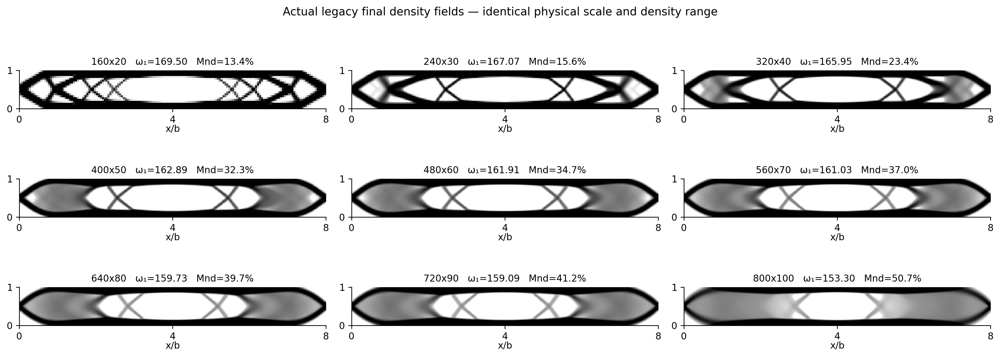

# Topology convergence

**TOPOLOGY_MESH_CONVERGENCE_INCONCLUSIVE** for the intended method. Actual legacy endpoints preserve a broad beam layout but fail to demonstrate a stable refined density field.

The top and bottom chords, central opening and end load paths persist. The coarse 160 design has multiple small end holes and narrow diagonals. From 240 onward the end layout simplifies; by 400 the end regions contain substantial gray material. The fine sequence becomes more diffuse, and at 800 the central opening shrinks markedly and diagonal members fade into gray regions. Vertical mirror symmetry holds to approximately 10^-11 in mean absolute density; left/right differences are small (0.002–0.016) but nonzero. Thus gross asymmetry is not the main failure. Persistent gray zones are.

## Physical-coordinate metrics

Cell-centre bilinear interpolation onto a common domain x/b∈[0,8], y/b∈[0,1], with edge extension to the domain boundary. No registration, reflection, density projection, threshold-volume correction or smoothing beyond interpolation. L1 is mean absolute density difference; L2 is RMS (domain-normalized). Correlation uses full sampled densities. IoU uses rho≥0.5. Boundary metric is symmetric distance between eroded-mask boundary pixels, including domain-edge boundaries; mean, 95th percentile and Hausdorff are in units of b. Thresholded metrics are diagnostics of a gray design, not manufacturability certificates.

| Adjacent meshes | L1 | L2 RMS | Correlation | IoU | Boundary d95/b |
| --- | --- | --- | --- | --- | --- |
| 160x20 -> 240x30 | 0.109684 | 0.227976 | 0.868567 | 0.797481 | 0.0921954 |
| 240x30 -> 320x40 | 0.0695238 | 0.137857 | 0.951575 | 0.881979 | 0.0395285 |
| 320x40 -> 400x50 | 0.089143 | 0.182679 | 0.906777 | 0.811156 | 0.0841129 |
| 400x50 -> 480x60 | 0.0481459 | 0.122901 | 0.954016 | 0.833532 | 0.0816241 |
| 480x60 -> 560x70 | 0.0606416 | 0.148512 | 0.930679 | 0.835615 | 0.0782764 |
| 560x70 -> 640x80 | 0.0434899 | 0.107957 | 0.962115 | 0.911959 | 0.0691466 |
| 640x80 -> 720x90 | 0.0191406 | 0.046024 | 0.992919 | 0.960196 | 0.0176777 |
| 720x90 -> 800x100 | 0.0566888 | 0.100909 | 0.96579 | 0.753061 | 0.145 |

The 640→720 pair looks close (L1=0.01914, IoU=0.9602), but 720→800 reverses that trend (L1=0.05669, IoU=0.7531, boundary d95=0.145b). The latter IoU is the worst adjacent overlap in the series. This directly blocks a conclusion based on the penultimate close pair. Common grids with 200 and 400 cells through height agree closely; the complete sensitivity results are in [TOPOLOGY_METRICS.csv](TOPOLOGY_METRICS.csv).

Native-grid four-connected component counts at rho≥0.5 are 23,1,1,1,1,3,1,1,3. These are threshold-sensitive island counts, not evidence of 23 macroscopic load paths. The atlas and boundary metrics matter more than count alone. There is evidence of changing member/void morphology and increasingly diffuse end zones, but no controlled evidence of a genuine optimization-basin bifurcation rather than stopping-induced changes.

Fixed physical radius does not deliver demonstrated mesh-independent morphology in this campaign. It also does not prove that the filter causes the changes; see FILTER_AUDIT.md.
